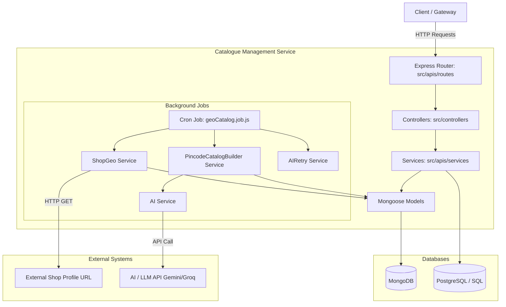
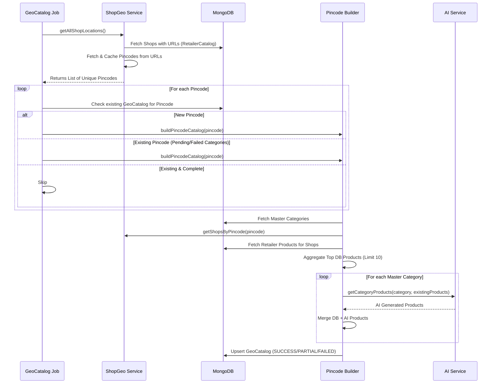

# Catalogue Management Service - Architecture & Workflow

## 1. Overview
The `catalogue_mgmt_service` is a microservice built with Node.js and Express. It is responsible for managing catalogs, categories, and products for various shops. One of its primary and most complex functionalities is the **Geo-Catalog** generation, which aggregates product data from shops across different pincodes and augments it with AI-generated products to provide a comprehensive master catalog per location.

---

## 2. Architecture Diagram



---

## 3. Core Workflows

### 3.1. Nightly Geo-Catalog Cron Job Workflow
The core background task runs nightly (at 2:00 AM IST) to rebuild the geographic catalog for all serviced pincodes.



### 3.2. Detailed Logic: What the Code is Doing

#### **Server Initialization (`server.js` & `InitApp/index.js`)**
- **Bootstrapping**: The app uses `express`, `cors`, `morgan` (for request logging), and `dotenv` for environment configurations.
- **Utility Integrations**: It integrates `sarvm-utility` for standardized error handling, request formatting, and JWT authentication (`AuthManager.decodeAuthToken`).
- **Session Management**: Uses `cls-hooked` to create a namespace (`sessionName`) to track `sessionId` and `clientIp` across asynchronous operations.
- **Databases**: Connects to an SQL Database (`@db/SQL`) and MongoDB (`@db/index`).
- **Jobs**: Automatically invokes `startGeoCatalogJob()` on startup.

#### **Geo-Catalog Cron Job (`src/jobs/geoCatalog.job.js`)**
- **Schedule**: Uses `node-cron` to schedule the task at `0 2 * * *` (2 AM IST).
- **Execution Flow**:
  1. Calls `shopGeoService.getAllShopLocations()` to get all unique pincodes active in the system.
  2. Iterates over each pincode sequentially. It intentionally does not stop on error (`try/catch` inside the loop) to ensure one failing pincode doesn't halt the entire job.
  3. Checks if the `GeoCatalog` for a pincode exists. If it's new, it builds it. If it exists but has a `PARTIAL` or `FAILED` state, it rebuilds it.
  4. Introduces a delay (`DELAY_MS`, default 2000ms) between processing pincodes to prevent rate-limiting or overloading the AI/DB.
  5. After the main loop, it re-fetches shops to "discover" any new pincodes that might have appeared while the job was running.

#### **Pincode Catalog Builder (`src/apis/services/v1/pincodeCatalogBuilder.service.js`)**
- **Purpose**: Creates a curated list of products for a specific pincode, combining actual retailer inventory with AI-generated suggestions.
- **Logic**:
  1. **Master Categories**: Fetches all valid categories from the `Catalog` collection (ignoring test categories).
  2. **Shops & Inventory**: Fetches all `shopId`s for the given pincode. Then fetches all `RetailerCatalog` documents for those shops.
  3. **Aggregation**: Builds a `retailerCategoryMap`, grouping exact normalized product names under their respective master category and counting their occurrences. It sorts products by frequency.
  4. **Merge (DB + AI)**: For every master category:
     - Takes the top frequently occurring products from the DB (up to `DB_LIMIT`, which is 10).
     - Passes these DB products to the `ai.service` to ask the LLM to generate more relevant products for this category.
     - Takes up to `AI_LIMIT` (10) AI-generated products, ensuring no duplicates.
  5. **Master Request**: Calls `createRequestsForMissingMasterProducts` to add newly generated products to the global master catalog if they don't exist.
  6. **Save**: Upserts the resulting document into the `GeoCatalog` collection.

#### **Shop Geo Service (`src/apis/services/v1/shopGeo.service.js`)**
- **Purpose**: Resolves the geographical pincode for shops.
- **Logic**:
  - Fetches shops from `RetailerCatalog` that have a non-null `url`.
  - Uses an in-memory `pincodeCache` (`Map`) to store resolved pincodes to avoid redundant network calls.
  - If a shop is not in cache, it uses `axios` to fetch the external `url` profile and runs `extractPincode` to deeply parse the JSON response (`data.shop.location.pincode`, etc.).

#### **AI Retry Service (`src/apis/services/v1/aiRetry.service.js`)**
- Acts as a fallback for the builder. If the `GeoCatalog` has categories marked as `PENDING` or `FAILED` (due to AI timeouts or errors), this service specifically targets those categories, retries the AI generation, appends the products, and marks them as `DONE`.

---

## 4. API Endpoints Overview

The application exposes multiple REST APIs under `/v1`. Here is a breakdown of the key modules:

### **4.1. Catalog Management (`/v1/catalog`)**
- `GET /` & `GET /getAllCatalogList`: Retrieves paginated lists of catalogs.
- `GET /:catalog_id`: Retrieves a specific catalog by ID.
- `POST /`: Creates a new master catalog. Validates input using AJV middleware.
- `PUT /:catalog_id`: Updates a catalog.
- `DELETE /:catalog_id`: Deletes a catalog.
- `GET /image` & `GET /getCatalogImage`: Handles pre-signed URLs and fetching images.
- `POST /processJsonMongoCatalog`: Imports a catalog from an external JSON URL into MongoDB.

### **4.2. Geo Catalog (`/v1/geo`)**
- **Test Routes** (Phase 1):
  - `POST /test/pincode`: Triggers catalog generation for a test pincode.
  - `POST /test/shop`: Triggers shop-level catalog processing.
- **Production Routes** (Phase 2):
  - `GET /catalog`: Fetches the fully resolved geo-catalog data for the frontend.
  - `POST /apply`: Applies geo-catalog configurations.
  - `POST /cron/trigger`: A manual trigger to start the nightly cron job synchronously/asynchronously for debugging.

### **4.3. Other Endpoints (Found in Router)**
- `category.js`: APIs for managing product categories.
- `product.js`: APIs for managing individual master products.
- `populate.js`: APIs for bulk data population and seeding.
- `BulkUpdateProduct.js`: APIs for batch updating product prices, inventory, etc.

---

## 5. Directory Structure Details

```text
catalogue_mgmt_service/
├── server.js                        # Entry point, configures Express, connects routers and middlewares.
├── src/
│   ├── InitApp/index.js             # Initializes DB connections (SQL, Mongo), Session Namespace, Starts Cron.
│   ├── apis/
│   │   ├── routes/v1/               # Express Router definitions for all endpoints.
│   │   ├── controllers/             # Request handlers, orchestrates logic between route and services.
│   │   ├── services/                # Core Business Logic (Pincode Builder, Shop Geo, AI Retry, etc.).
│   │   └── models/                  # Mongoose Schema definitions.
│   │       ├── mongoCatalog/geoCatalogSchema.js
│   │       ├── mongoCatalog/retailerSchema.js
│   │       ├── mongoCatalog/catalogSchema.js
│   │       └── ...
│   ├── common/                      # Shared utilities, validations (AJV), AWS/Kafka integrations.
│   ├── config/                      # Environment variables mapping, constants.
│   ├── jobs/                        # Background tasks.
│   │   └── geoCatalog.job.js        # The nightly cron job script.
│   └── scripts/                     # One-off or migration scripts.
├── .env files                       # Environment specific configuration files.
└── package.json                     # Dependencies and scripts.
```

---

## 6. Minute Details & Best Practices Adopted

1. **Graceful Failures**: In the Cron Job, operations iterating over multiple pincodes are wrapped in individual `try/catch` blocks. If one pincode fails (e.g., AI timeout, parsing error), the loop logs the error but *continues* to the next pincode.
2. **Caching Strategy**: `shopGeo.service.js` utilizes an in-memory `Map` to cache pincodes per `shopId` during the job run to prevent spamming external HTTP endpoints.
3. **Smart Re-processing**: The Geo-Catalog builder tracks state (`SUCCESS`, `PARTIAL`, `FAILED`). It avoids rebuilding perfectly fine pincodes but ensures failed ones are automatically picked up in the next run.
4. **Data Normalization**: `pincodeCatalogBuilder.service.js` employs heavy sanitization (`normalizeName`, `exactProductName`) to ensure DB products and AI products are accurately deduplicated based on lowercase, special-character-stripped strings.
5. **Rate Limiting/Throttling**: The cron job explicitly uses a `delay()` helper (`GEO_CRON_PINCODE_DELAY_MS`) between processing pincodes to act as a backpressure mechanism against the Database and AI API.
